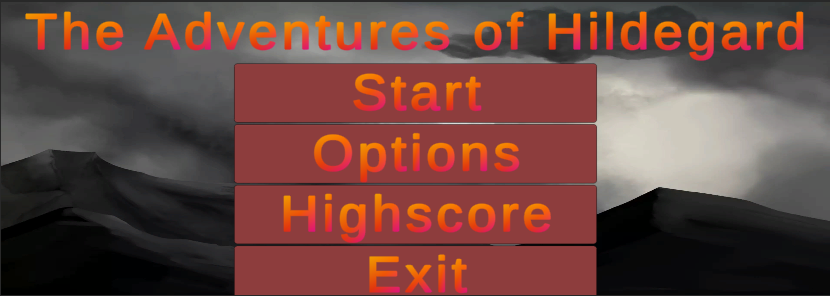

# A Game where to find the ESCAPE
### Group18_Hildegard

## A description about the project.
### What is the content?
This project is a game in Unity where the player is in an Escape Room in a mysterious room complex / maze system in the house of the dead Hildegard.
The player has to find the key items to open the door and get into the next room until 
the Exit is found.
To encounter this tough task, a time limit is set to increase the pressure.

* There are different modes (Timer versus no timer)
* One has to solve different mysteries while navigating through some rooms / maze.
* Interaction with object or things will lead to new discoveries

### How to play:
* Move with arrow keys (forward / backward)
    * Arrow keys to the side rotates camera view leftwards or rightwards (like turning left or right)
* Moving mouse allows a pointer to move through the image
    * A high quality hand image represents the mouse with interactive features
    * Needed for interaction with environment (solving the mysteries / doing actions)
* Space bar allows jumping

### Special features
* Menu with different options
    * Start (the game)
    * Options (E.g. if there should be a timer aka hard-level)
    * Highscore (listing the achievements of previous games)
    * Exit (the game)



<br />

* Music
    * There will be music that should give a feeling of "horror" as one would expect in such a game
* Scenes
    * There will be different scenes by each group member. (Also to avoid merge conflicts) 
* Assets
    * Selected Assets are used.

### Miscellaneous
This project was built from scratch.

## A description of how to use and test the code
How do I get this project to work on my machine? How can I develop for this project?

* Download Unity: [Download Website](https://unity3d.com/de/get-unity/download)
* Use Version: Unity Editor 2019.4.21f1 (LTS)
* Download [repository](https://github.com/DanielAlmes/Group18_Hildegard)

```shell
$ git pull
```

```shell
$ git push
```

## Contributors
This is a project of Group 18 in the course 'Advanced Experiment Design in Unity' (SoSe 2021)
* Name 1
* Name 2
* Name 3

[Unity Website](https://unity.com/de)


## Further Information
The project is a game for the Advanced Experiment Design in Unity course of the SoSe2021.

> IGNORE THIS PART IF YOU ARE NOT A CONTRIBUTOR\
> How a `README.md` should look like
>
> https://github.com/18F/open-source-guide/blob/18f-pages/pages/making-readmes-readable.md